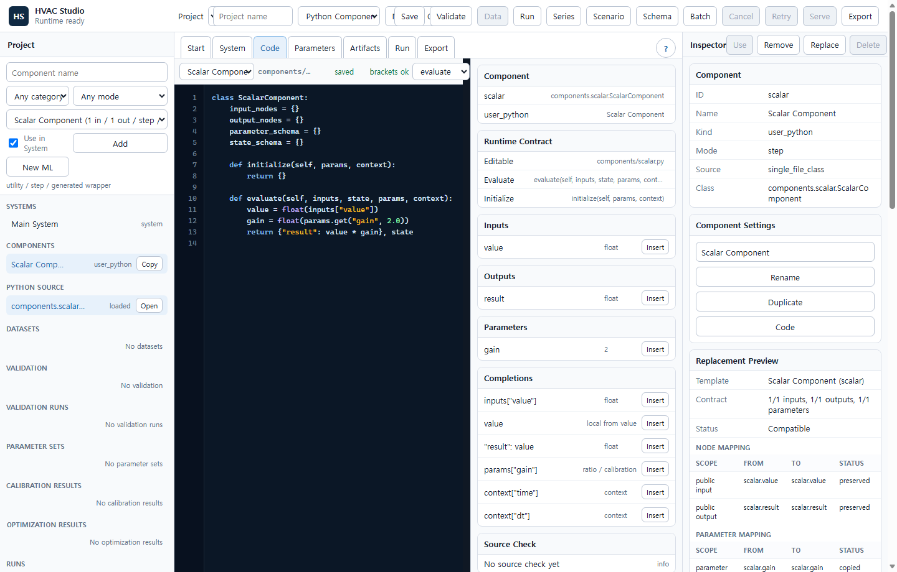
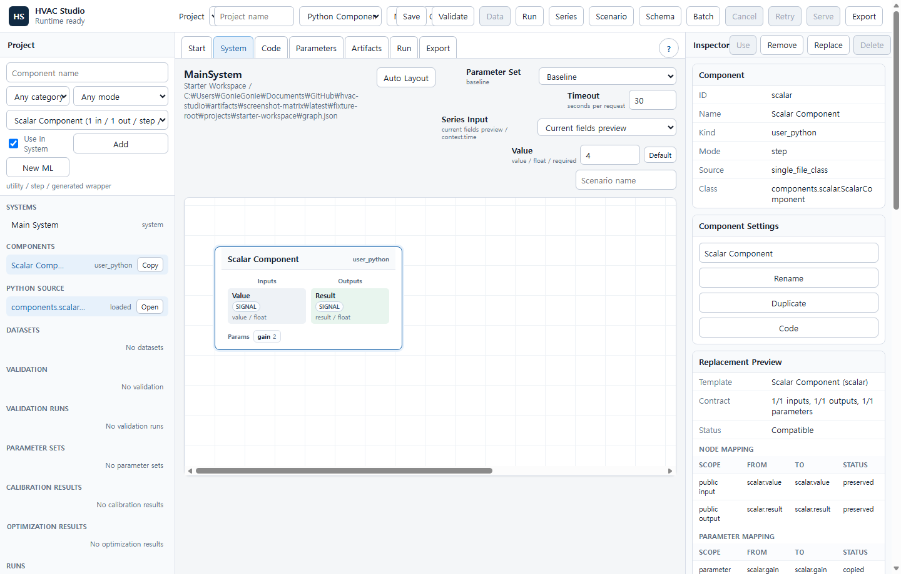
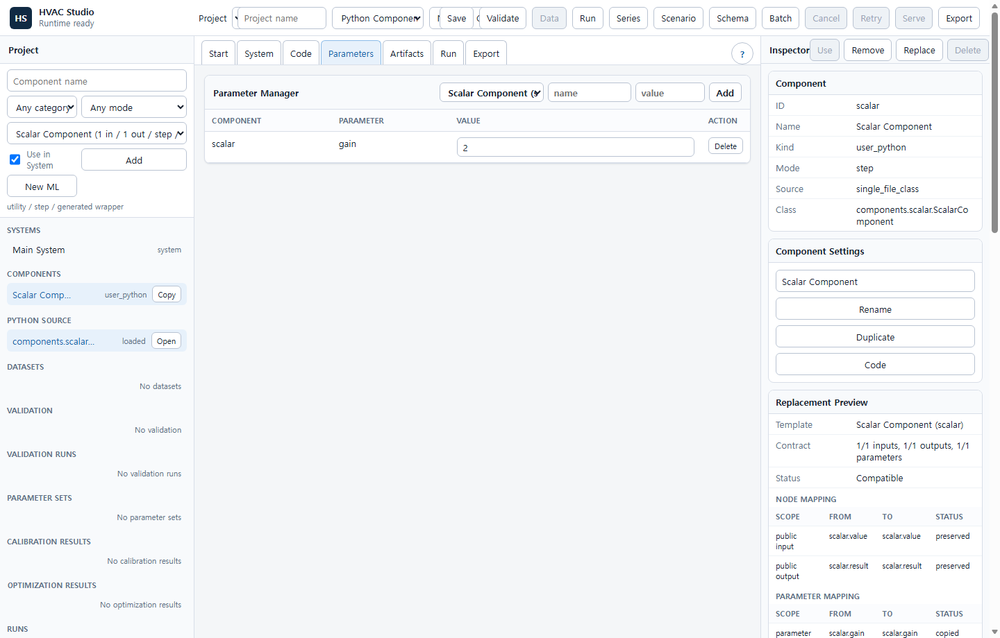
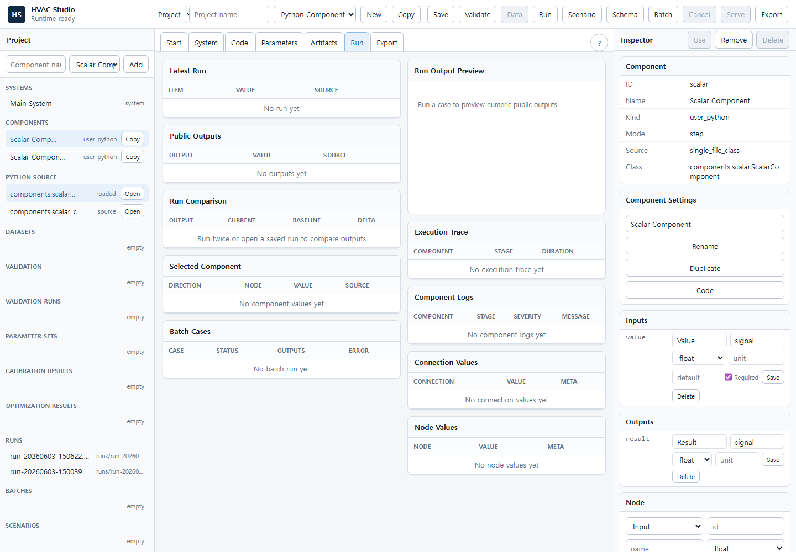
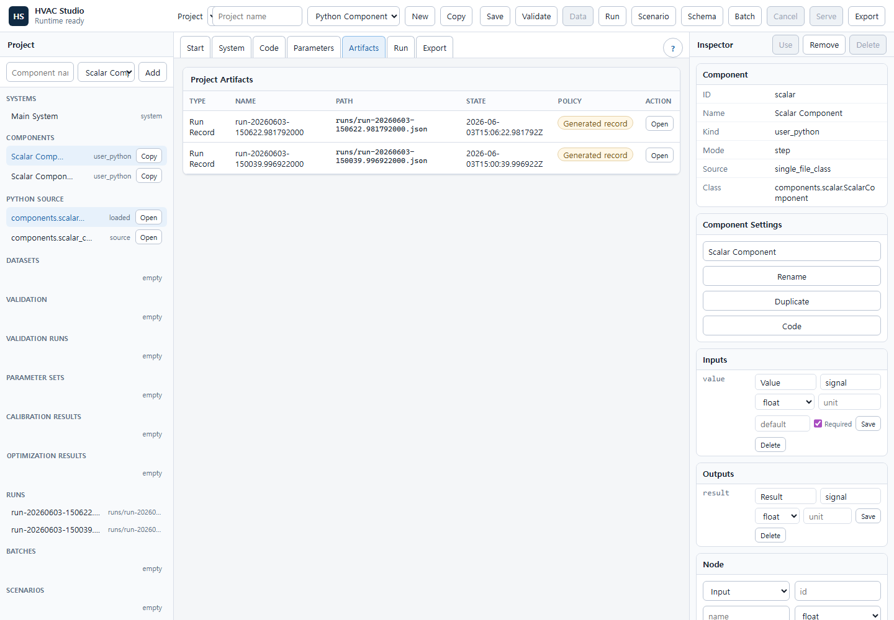
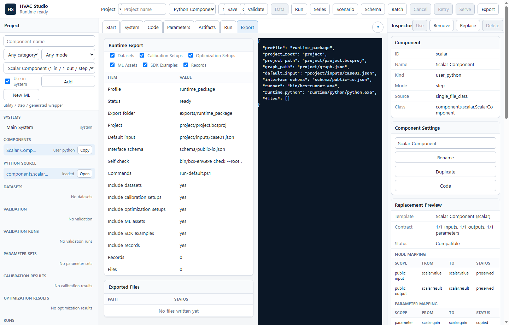

# Screenshot Tutorials

These walkthroughs use the current Studio workspaces as the map. Open the `?`
button beside the workspace tabs when you want the matching local reference page.

## Author A Component

1. Create or copy a workspace project.
2. Create a component from the Project panel or select one in the Project tree.
3. Let Studio open the Code workspace for the selected component.
4. Edit the component source inside the declared contract.
5. Use source check feedback before saving and running.

Read next:

- [Create Component](create-component.md)
- [Edit Python Function](edit-python-function.md)

## Build A System

1. Use the Project tree to add a component from a template.
2. Select a component to review its input nodes, output nodes, parameters, and
   state in the Inspector.
3. Connect compatible endpoints on the canvas.
4. Use public input and output mappings to decide what external callers can set
   and observe.
5. Validate the graph before running.

Read next:

- [Core Concepts](core-concepts.md)
- [Build System](build-system.md)

## Tune Parameters

1. Open the Parameters workspace.
2. Review graph defaults and active values by component.
3. Add or edit values in a named parameter set when you need a repeatable
   overlay.
4. Apply the parameter set before running, validating data, calibrating, or
   optimizing.
5. Keep baseline graph parameters stable unless the model definition itself is
   changing.

Read next:

- [Parameter Management](parameter-management.md)

## Run And Inspect

1. Set public inputs, context, timeout, and the active parameter set.
2. Run one case.
3. Compare the latest public outputs with the previous run.
4. Inspect selected component inputs, outputs, execution timing, connection
   values, node values, and component logs.
5. Save scenarios or reopen run records from the Project tree when a case matters.

Read next:

- [Run Simulation](run-simulation.md)
- [Troubleshooting](troubleshooting.md)

## Validate, Calibrate, And Optimize

1. Import a dataset and create a validation mapping from public input and output
   columns.
2. Run data validation and review saved validation records.
3. Create calibration setups from measured outputs and candidate parameters.
4. Run calibration, then save the best candidate as a parameter set.
5. Create optimization setups from decision variables and objective outputs, then
   save useful results as scenarios, scripts, or records.
6. Use the Artifacts workspace to reopen generated records and source artifacts
   without hand-editing JSON.

Read next:

- [Data Validation](data-validation.md)
- [Calibration](calibration.md)
- [Optimization](optimization.md)

## Use The SDK

The Python SDK is for scripts, studies, and external tools that need repeated
evaluations without reimplementing the runtime. It wraps `bcs-runner serve`, so
the same project files and public IO contract used by Studio are still the source
of truth.

1. Validate the project in Studio or with the CLI.
2. Export or locate the runner executable.
3. Start `RunnerClient` from Python.
4. Call repeated evaluations, validation, calibration, optimization, batch, or
   schema helpers.
5. Keep saved parameter sets, scenarios, mappings, and setup files in the
   project so Studio, CLI, SDK, and exports stay aligned.

Read next:

- [How It Works](how-it-works.md)
- [CLI Runner](cli-runner.md)

## Deliver A Runtime Package

1. Validate and run the workspace project.
2. Open Export.
3. Generate the runtime package.
4. Run the exported self-check from the package folder.
5. Use generated scripts for run, batch, validation, calibration, and
   optimization workflows when those source artifacts exist.
6. Ship the exported folder with its schema, manifest, runner tools, project
   files, and workflow scripts.

Read next:

- [Export Runtime](export-runtime.md)
- [Artifact Compatibility](artifact-compatibility.md)
